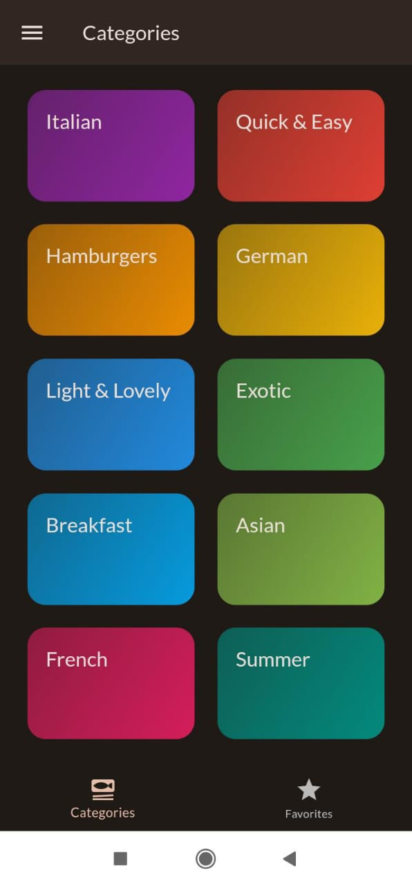
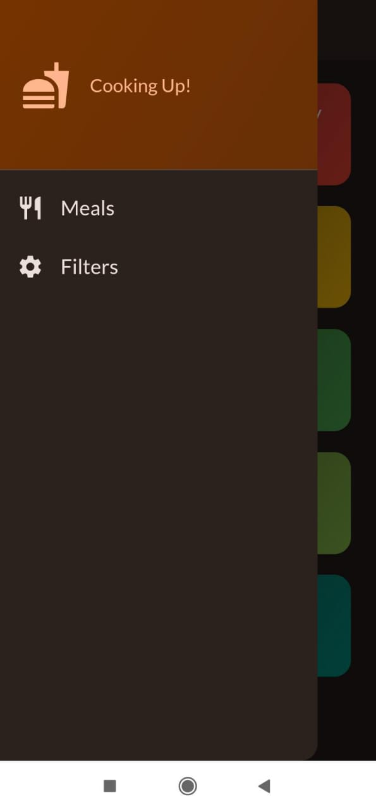
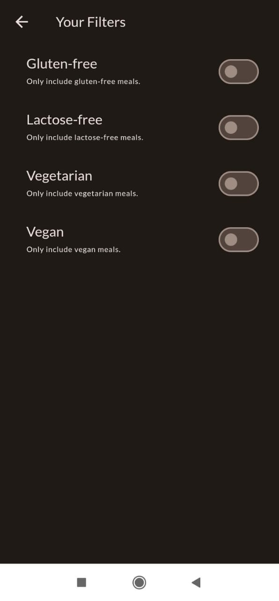
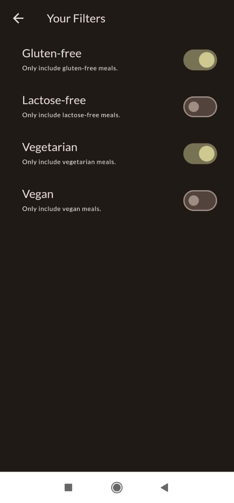
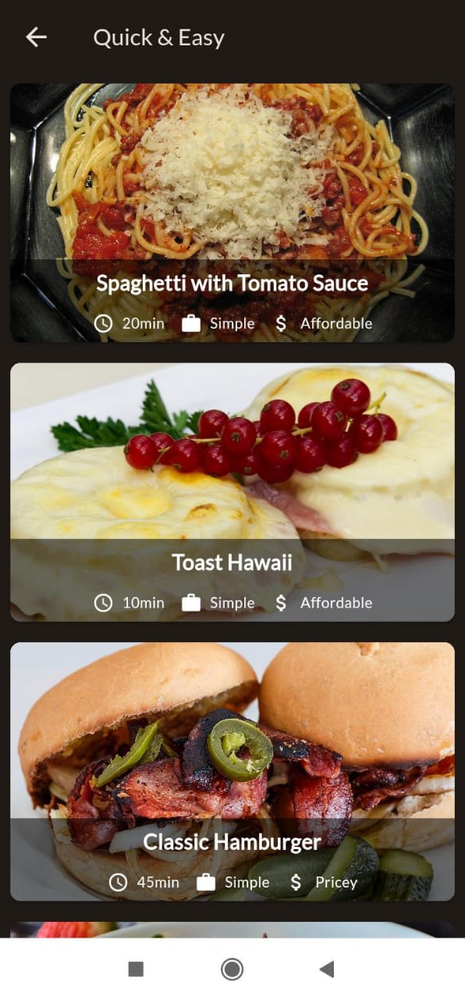
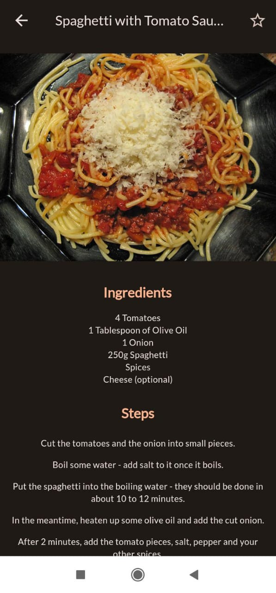
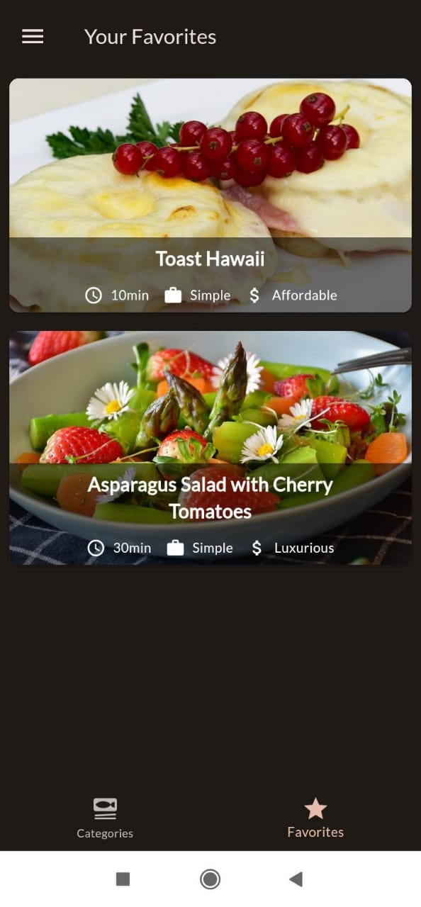

# Meal Prep App

Meal Prep App is a Flutter-based application that helps users discover and prepare meals from various categories. Users can explore dishes, check ingredients, follow preparation steps, and apply dietary filters to suit their preferences. Favorite dishes can be saved for easy access.

## Features

- **Browse Categories**: Explore different categories of food such as Italian, Breakfast, Asian, French, Quick and Easy, and more.
- **View Dishes**: Click on a category to view the dishes belonging to it.
- **Detailed Recipes**: Click on a dish to view its ingredients and preparation steps.
- **Dietary Filters**: Apply filters such as Gluten-Free, Lactose-Free, Vegetarian, Vegan, etc.
- **Favorites**: Add dishes to favorites by clicking the star icon and view all favorite dishes in the Favorites tab.

## Screenshots

<p >
    
    
  
    
    
    
  
  
</p>


## Getting Started

### Prerequisites

- Flutter SDK: [Install Flutter](https://flutter.dev/docs/get-started/install)
- Dart SDK (included with Flutter)

### Installation

1. Clone the repository:
    ```sh
    git clone https://github.com/aparnaprabhuu/Meal-Prep-App.git
    ```
2. Navigate to the project directory:
    ```sh
    cd Meal-Prep-App
    ```
3. Install dependencies:
    ```sh
    flutter pub get
    ```

### Running the App

1. Ensure a device is connected or an emulator is running.
2. Run the app:
    ```sh
    flutter run
    ```
